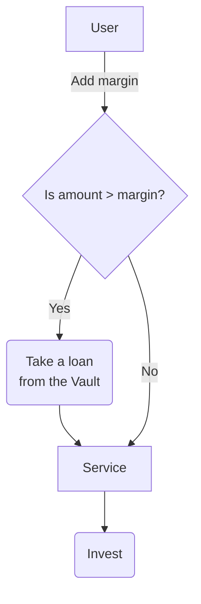
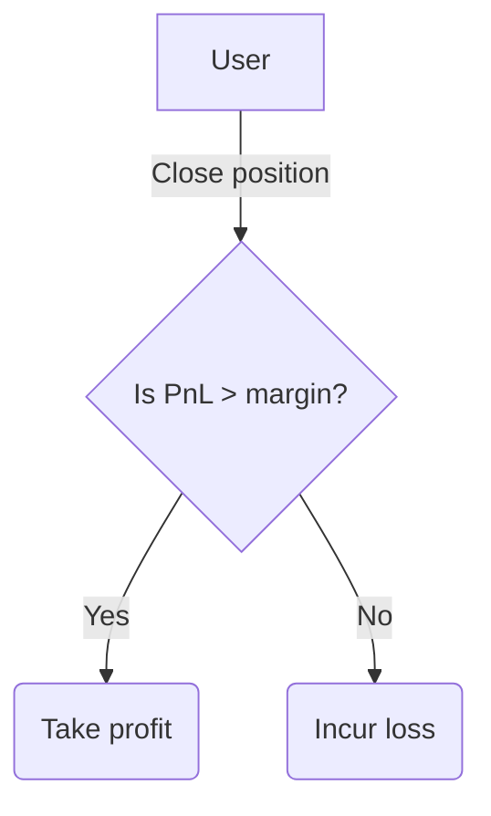

# Borrowing
Access the web3 space with more capital than the one at your disposal

---

Thanks to Ithil's financial services, anyone can fully engage and experience the web3 space; the seamless workflow allows the user to enter into any service with a few clicks, letting Ithil handle all the intricate procedures required to do it.
An internal system of undercollateralised loans allows for a *true* capital boost, in which funds are borrowed from Ithil's liquidity vault to be invested, and the outcome of the specific service is *locked* in the service contract.
In order for a user to access a service, a *margin* must be posted into the service smart contract; this is required to cover potential losses the vault may incur in the event of an unfavourable market movement.

## Take Loan

The opening of a position is done in three steps:
- The user posts some margin into the service and sets the desired investment parameters
- The service borrows funds from the vault, if the desired amount to be invested is higher than the margin posted
- The service performs all the internal and external calls to invest (eventually borrowed) assets on other protocols while resulting assets (LP tokens, NFTs, ...) stay locked within the service contract itself.

Since the amount used might be higher than the user's initial capital, the investment can be *leveraged*: in this way, the assets obtained will have a much higher value than if the user directly buys them from an external protocol.

## Repay

The closure of a position is likewise done in three steps:
- The assets are exchanged internally or through an external protocol, to obtain the initial token used for the investment
- The service repays the loan taken from the vault, plus interest rates and fees
- The remaining part of the payoff is given back to the trader.

A side note, the *profit and loss* or PnL is computed as follows 
$$
PnL = amount - loan - fees
$$
