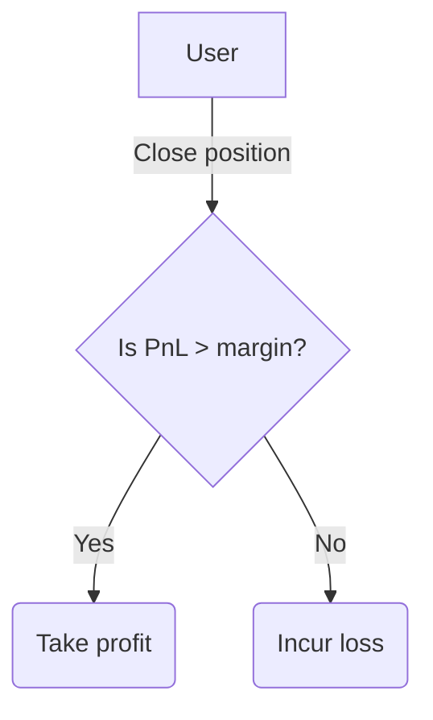

# Borrowing
Multiplying the capital to run a strategy by borrowing

---

With Ithil, anyone can profit from a wide variety of DeFi market scenarios by performing leveraged investments; the seamless workflow allows the trader to enter into any investment strategy with few clicks, letting Ithil deal with all the complex procedures necessary to implement a particular strategy.
A *true* leverage is made possible by an internal system of uncollateralised loans, in which the funds are borrowed from Ithil's liquidity vault to be invested and the result of the particular investment is *locked* in the strategy contract.
In order for a user to be able to perform a leveraged investment via a selected strategy, there must be some *margin* posted into the strategy smart contract; this is necessary to cover for potential losses the vault could incur in the case of an unfavorable market movement.

## Take Loan

The opening of a position is done in three steps:
- The user posts some margin into the strategy and sets the desired investment parameters
- The strategy borrows funds from the vault, if the desired amount to be invested is higher than the margin posted
- The strategy performs all the internal and external calls to invest (eventually borrowed) assets on other DeFi protocols while resulting LP tokens stay locked within the strategy itself.

Since the amount invested might be higher than the user's initial capital, the investment can be *leveraged*: in this way, the assets obtained will have a much higher value than if the user directly buys them from an external protocol.

## Repay

The closure of a position is likewise done in three steps:
- The assets are exchanged internally or through an external DeFi protocol, to obtain the initial token used for the investment
- The strategy repays the loan taken from the vault, plus interest rates and fees
- The remaining part of the payoff is given back to the trader.

A side note, the *profit and loss* or PnL is computed as follows 
$$
PnL = amount - loan - fees
$$