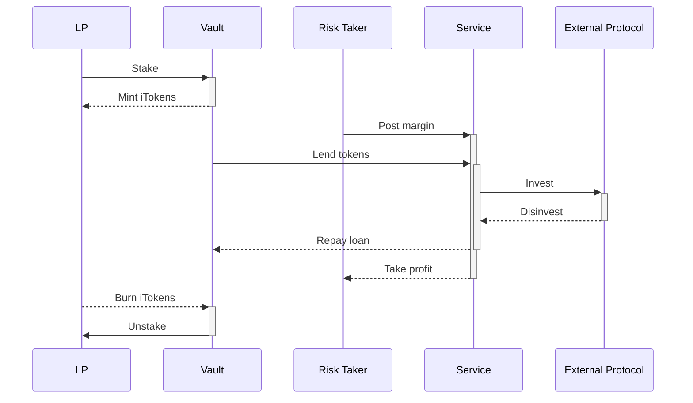

# How it works
Take a look under the hood

---

## Core Architecture

The protocol at its core consists of a lending and borrowing engine and modular ancillary services that can be added at any point in time via a governance vote.
* **Vault**: gathers deposits from LPs and issues loans to services;
* **iTokens**: yield-bearing ERC20 tokens that map LPs' deposits into the Vault;
* **Service**: performs a set of actions on other protocols to generate a revenue;
* **Liquidator** bots: ensure all loans are covered, liquidating the related position if not.

On a general level, Ithil is a two-sided platform featuring lenders (or *LP*s) and borrowers (so on called *Risk Takers*). LPs stake liquidity in the Vault and obtain in exchange an APY in the same token they deposited. Risk-takers, on the other hand, can execute whitelisted services with a capital boost by adding a margin as protection to the loan. Only when the risk-taker closes a position, they can withdraw eventual profits, provided their investment can pay off the loan and the protocol fees.

