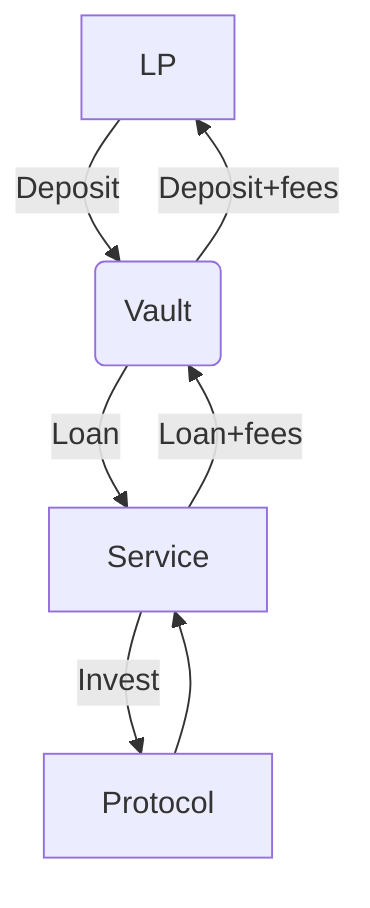

# Lending
Undercollateralised loans are the core of Ithil

---

In order to allow the users to access services with more capital than the one used, Ithil adopts a system of **internal undercollateralised loans**, in which the amount internally transferred from the token Vault to the service is higher than the margin posted by the user. This is possible because the assets resulting from this loan are locked into the service: they do not go outside Ithil's contracts.

Any user can supply any supported ERC20 token to the protocol, regardless of which chain their tokens live upon. The fees generated by the traders' activity will be redistributed to LPs, so that their staked assets will increase in number. If you give DAI, you will receive more DAI. No synth assets or strange tokens to swap.
LPs will receive a yield-bearing ERC4626 share token representing their deposit, that can be further exchanged on dexes, used as collateral or put into farming on other protocols. When a LP wants to redeem their staked tokens, their yield-bearing tokens will be burned and the underlying liquidity will be transfered together with the fees accrued.

### The Vault

The lending contract is the **Vault**, where **liquidity providers** (LPs) can stake their tokens and get the fees and interest generated by the investments. The list of supported, or **whitelisted** tokens is managed by the governance following security and market criteria. All whitelisted tokens can be staked in the Vault, thus making Ithil a good choice to get APY *in virtually any token*.

The liquidity given to the service in the form of loans is protected by the user's margin and by **liquidators**, which close the positions whose margin has been eroded by more than a service-specific **risk factor**, and get rewarded for this. Since, due to very unfavorable market conditions, liquidators may fail to properly liquidate a given position, the Vault's liquidity is further protected via the **insurance reserve**: governance-owned liquidity which is used to restore a liquidity loss due to a bad liquidation. The amount of the insurance reserve is adjusted *algorithmically* to insure good capital protection and at the same time a competitive interest rate for liquidity providers.

When a loan is taken from a service, the Vault computes the interest rate at which the loan is taken. This is calculated taking several factors into account:
- The riskiness of an investment, captured in a number called **risk factor**. 
- The **usage**, which is the amount of open loans with respect to the free liquidity.
- The **uninsured portion** of the Vault, which is the percentage of the total balance which is not insurance reserve.
- The **collateralisation** of the position, which is the ratio between the borrowed amount and the margin (denominated in borrowed tokens).
The final interest rate is then directly proportional to these four numbers, i.e. it's the multiplication of all of them renormalised by a global factor. The interest rate is computed considering the Vault state at the opening of a position, while the due fees are calculated at the closure of the same position.

Finally, a small **fixed fee** is set by the governance and it is charged as a percentage of the borrowed amount, regardless of the duration of the position. This reduces the economic rationale of potential attacks in which positions are open and closed immediately, like in flash-loans.

Since taking a loan when the Vault is almost totally used is extremely costly, this formula assures that there will likely be some amount of free liquidity which can be *redeemed* at any time by liquidity providers. If all free liquidity has been withdrawn by LPs, as some positions are closed it will be costly to open new ones, thus again assuring, after a short period of time, the availability of further liquidity to support withdrawals, in a positive feedback cycle.

When a position is closed and fees are paid to the Vault, a portion of them go to the insurance reserve. This portion is algorithmically computed to make the insurance reserve ratio converge towards an **optimal ratio**: at the optimal ratio, the fees going to the insurance reserve are at a minimum, and the governance has the right of redeeming the excess insurance reserve (but not beyond the optimal ratio).

### LP tokens

In order to assure a fair and gas-efficient fees distribution method, Ithils adopts the classical method of LP tokens, which are minted to liquidity providers in a quantity reflecting the *share price* of the given LP token. The **total wealth** of the Vault is the quantity of tokens deposited in total by liquidity providers, plus all fees generated and not claimed. This can be calculated as the total balance excluding governance-owned liquidity, plus the open loans. When a liquidity provider deposits some amount of (for instance) DAI, then some amount of LP tokens iDAI will be minted, calculated as follows.

$$
Minted\ iTokens = deposit\ amount * \frac{Total\ Supply_{\, iTokens}}{Total\ Wealth}
$$

Similarly, an holder of iDAI can burn at any time its tokens, thus receiving a transfer of DAI calculated as follows.

$$
Transfer\ amount = burned\ iTokens * \frac{Total\ Wealth}{Total\ Supply_{\, iTokens}}
$$

The factor of the burned amount in the previous formula is the **share price** of the LP token considered.
In this way, a liquidity provider trying to deposit and withdraw immediately some funds, will receive exactly the same amount deposited, and only the fees generated *after* the deposit will contribute to the provider's APY: no arbitrage is possible. Moreover, a simple calculation shows that neither deposits nor withdrawals change the share price, thus the effect of a liquidity provider withdrawing or deposit is not seen by others.

Profits matured by the Vault are unlocked over time to prevent flash loan or manipulation attacks.

#### Vault vulnerability prevention
The typical ERC4626 vulnerability related to an empty vault is prevented by forcing a deposit of 1 unit of token in the Vault, which then forces the share price to never be null. This is done at the creation of the Vault, and the resulting share token is locked and never used for any other purpose.

Let's make an example:

*attacker's first deposit = a*
*donation = d*
*victim's deposited amount = v*

**t0**
attacker's first supply = a
totalSupply after attacker's deposit = 1 + a 
totalAssets before victim's deposit = d + a + 1

**t1**
$$
\textit{victim's supply after deposit}: Floor[\frac{v (1+a)}{d + a + 1}] = v - Floor[\frac{d * v}{1 + a + d}] := S
$$

$$
\textit{attacker's withdraw after deposit}: Floor[\frac{a (v + d + a + 1)}{1 + a + S}] := W
$$

$$
\textit{claim}: W <= a + d
$$

> this means the attacker can withdraw at most what he has donated + what he has deposited at the beginning

Why
let's rewrite the function as:
$$
-d (1 + v) + (a + d) Floor[\frac{d v}{1 + a + d}]
$$
remove the *Floor* function and the always positive denominator as *Floor[(d v)/(1 + a + d)] <= v*
you get
$$
-d (1 + v) + (a + d) Floor[\frac{d v}{1 + a + d}] <= -d (1 + v) + (a + d) * [\frac{d v}{1 + a + d}] = -\frac{d (1 + a + d + v)}{1 + a + d} <= -d <= 0
$$
Thus the attacker extractable value is always negative, meaning that the attacker can't extract any value from the vault.

## APY Boost
We use an innovative model to **encourage staking on the platform in a non-dilutive way**.
Anyone can *boost* a specific token by staking and renouncing to the APY. By doing so, the other early stakers will benefit from an increased APY and the booster can withdraw their deposit at any point in time.

This model is very interesting for DAOs and protocols looking to promote their token and integration with Ithil.

### An example
Uniswap (or Ithil) wants to promote staking of the UNI token, they put 1000 UNI in the Vault and renounce to the 10% APY. A user stakes 10 UNI. They will experience an APY equal to staking 1010 UNI. Obviously, this system works for the early stakers, the more TVL is attracted the more the APY boost is diluted across all stakers.
