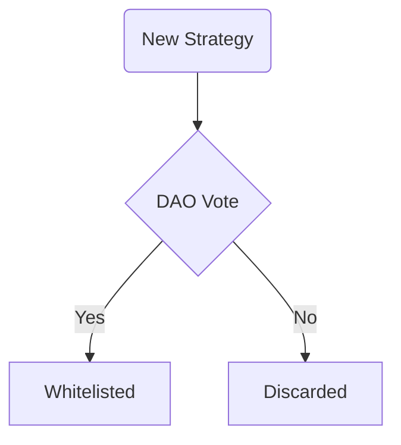
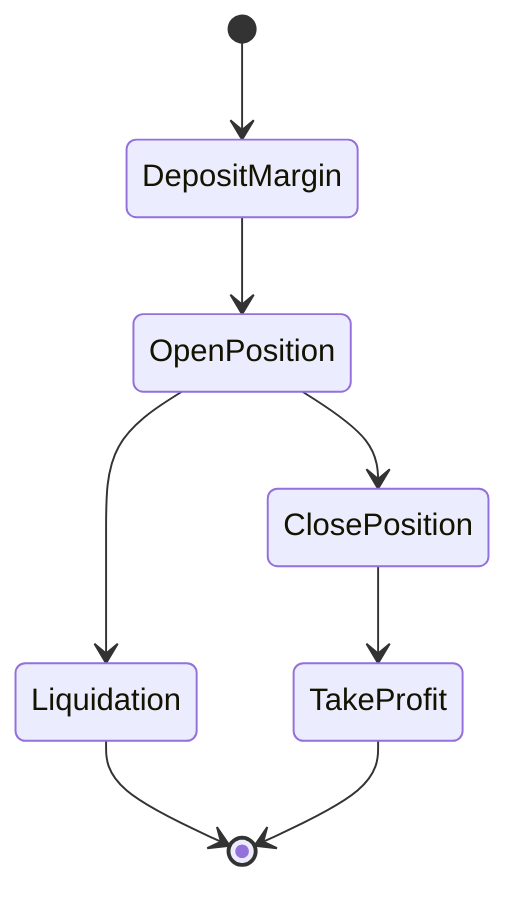

# Strategies
Ready-made and risk-diversified investments using DeFi legos

---

The strategies which can be implemented are in principle very general: Ithil's DAO can implement a new strategy at any time via a governance vote. Once whitelisted, the strategy contract is enabled to take loans from the Vault.

In order to prevent the governance to take faulty decisions which would put the protocol's liquidity at risk, all strategies must inherit from a common **base strategy**, an *abstract* contract which implements the borrow and repay logic agnostically from the particular investment logic. Such measure has the double advantage of setting a precise standard to assure the vault's liquidity is protected and to make the development of new strategies much simpler and faster.

Besides calling the relevant external contracts to perform the particular investment, the specific strategies must also implement a **quoter**, a view function which gives at every time the value of the obtained assets with respect to the initial token used to obtain them. This is important for liquidations and for margins given in the asset token.

Since the liquidity transferred from the vault and locked in the form of assets in the strategies belongs to the LPs, every time a loan is taken the vault computes the **interest rate** at which the liquidity can be borrowed for that particular investment. The calculation of the interest rate takes into account the riskiness of the investment, the amount of liquidity taken and the amount of margin posted by the user.

We give here two examples of simple strategies, while ideally **the strategies that can be implemented are potentially infinite and can vary in complexity and risk, covering pure DeFi to more structured TradFi-like ones**.

## Position tokenisation
All positions are represented as ERC721 NFTs that can be transferred, sold and purchased on secondary markets like OpenSea. Similarly to UniswapV3 NFTs, Ithil's position NFT when purchased give the new owner total control over the underlying margin and on the position itself, that can be instantly be edited or closed after the transfer transaction is settled.
