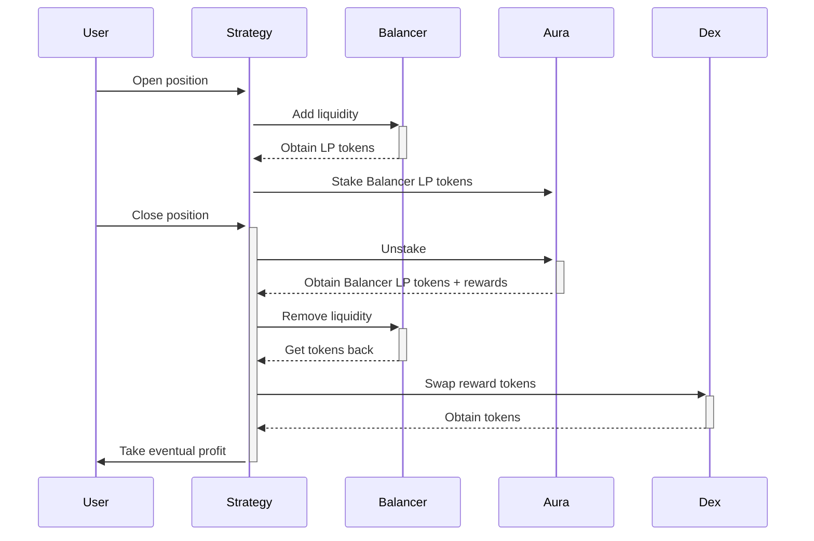

# Boosted balancer
Enjoy boosted APY with Balancer and Aura

---

Balancer is a very popular dex that, since the launch in 2020, has accrued a couple billions in TVL thanks to its flexible pools that can support two or more assets and different weights to minimise impermanent loss.
Aura finance, on the other hand, is a protocol that maximises Balancer rewards by pooling together all `BAL` deposits and `AURA` native tokens.

## Implementations
* Under development
