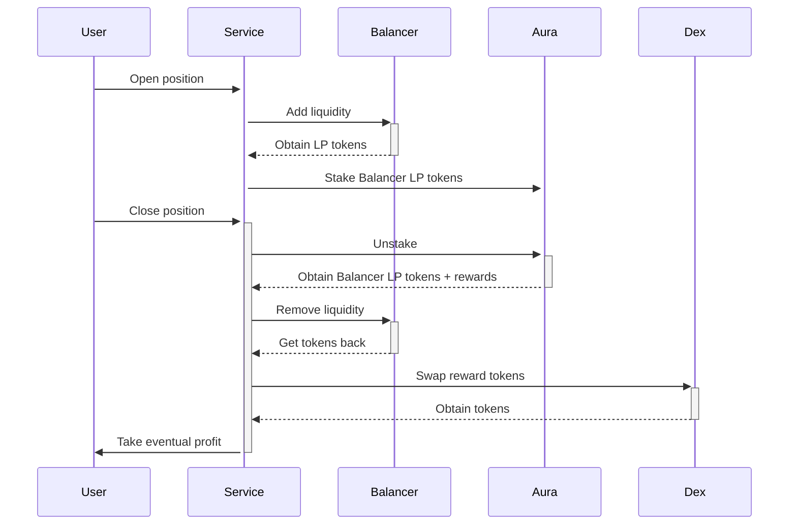

# Boosted balancer
Enjoy boosted APY with Balancer and Aura

---

Balancer is a very popular dex that, since the launch in 2020, has accrued a couple billions in TVL thanks to its flexible pools that can support two or more assets and different weights to minimise impermanent loss.
Aura finance, on the other hand, is a protocol that maximises Balancer rewards by pooling together all `BAL` deposits and `AURA` native tokens.

## Implementations
It is required for the user to enter the pool using proportional token amounts, so Ithil enforces that on a contract level. The user can choose to enter the pool with a single token, but the service will automatically convert it to the other token using the Balancer pool weights.
