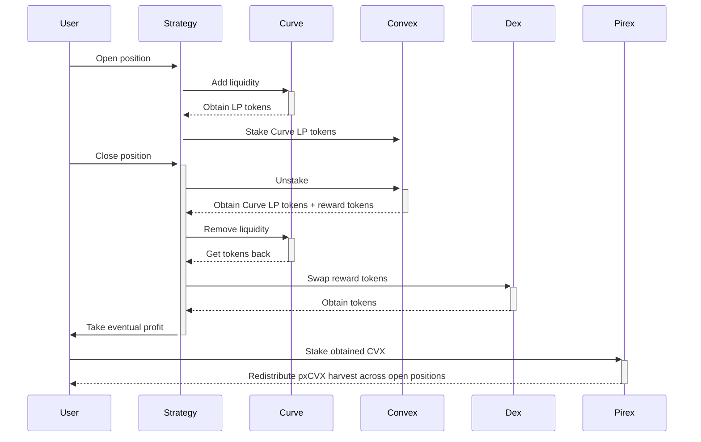

# Curve wars
Get exposure to the most popular battleground of DeFi

---

Curve finance is a popular decentralised exchange optimised for stablecoin swaps with more than $5bn in TVL.
Its tokenomics was designed to incentivise users to hold the CRV governance token in a staked representation, the ve-model, to vote on which pool to boost by enabling extra rewards. This system creates a huge pressure for DAOs and protocols looking to create a deep liquidity pool to make sure their pool is always voted.

To satisfy this need, other protocols like Convex were built to ammass large number of Curve governance tokens to reorient LP rewards in exchange of payments to the liquidity providers themselves (the so-called *bribes*).

Ithil offers users the opportunity to profit from this ecosystem without diving deep into the intricacies of each involved protocol. By providing single-sided liquidity to Curve and staking the resulting LP-token onto Convex, users can benefit from rewards coming from both platforms, besides the traditional swap fees accrued by the DEX activity.

## Implementations
* Under development
