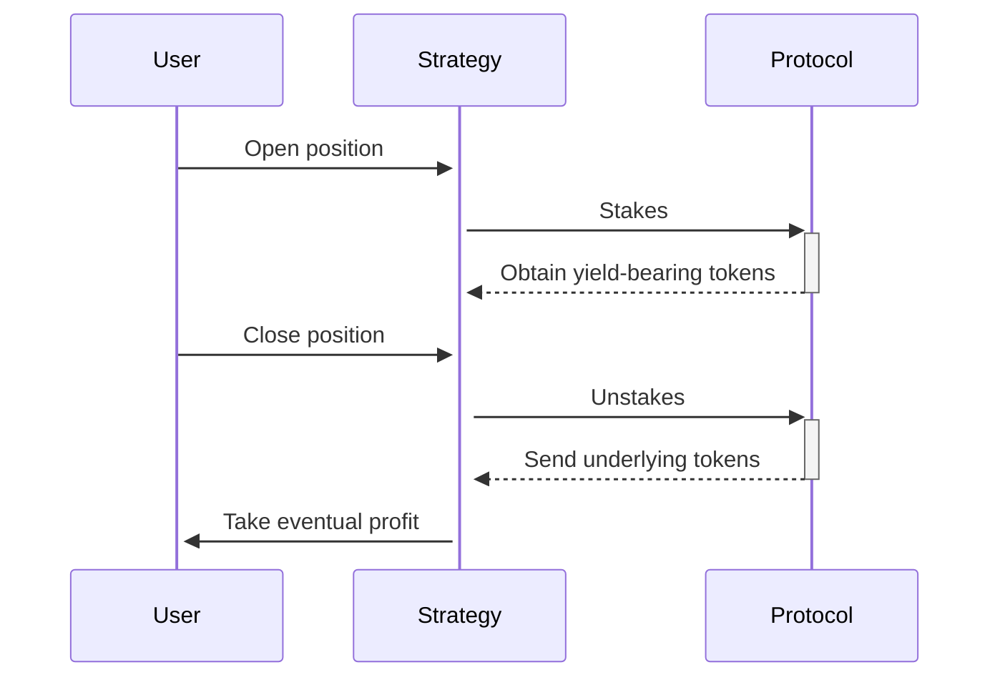

# Leveraged staking
Allowing traders to multiply their staking returns

---

Through the Leveraged Staking Strategy (LSS), the vault's liquidity can be borrowed and staked on an external protocols to get a leveraged yield. If the yield obtained from the staking protocol is higher than the interest rate necessary to borrow the funds, the difference represents a net profit for the user.

Let us make a numerical example using DAI and Yearn.

- A user posts a margin of 100 DAI to the YearnStrategy (a type of LSS) contract and decides to stake DAI on an external protocol like Yearn with a 10x leverage.
- The LSS contract will borrow 900 DAI from the vault and stake the 1000 DAI on Yearn, obtaining say 1000 yDAI, the wrapped tokens representing the stake.
- Assume that, after one month, the rolling APR of Yearn hah been 60%, thus giving a monthly gain of 5%. Assume also that the monthly interest rate applied by Ithil's vault has been 3%. 
- If the user closes its position, the 1000 yDAI will be redeemed on Yearn to obtain 1050 DAI, while the vault has to be repaied of 927 DAI (900 DAI borrowed, plus 3%). The remaining 123 DAI are given back to the user, who will see a 23% gain in one month using a staking protocol which has only given 5% of yield. This is possible thanks to the x10 leverage.

If the price per share increases less than the applied interest rate, the user may lose money.
If the interest accrued go above some critical level, the position will be liquidated.

## Implementations
Currently the following protocols support a leveraged staking service:
* Yearn (*automated investment vaults*) - [yearn.finance](https://yearn.finance)
* Euler (*overcollateralised lending protocol*) - [euler.finance](https://euler.finance)
