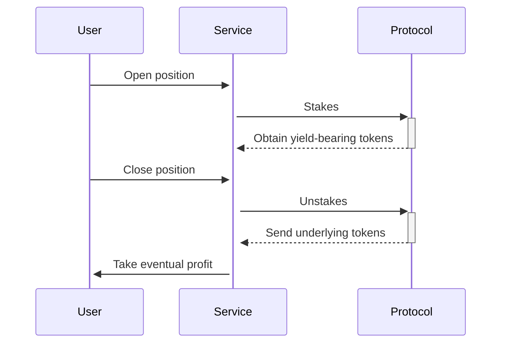

# Leveraged staking
Allowing traders to multiply their staking returns

---

Through the Leveraged Staking Service (LSS), the vault's liquidity can be borrowed and staked on an external protocols to get a leveraged yield. If the yield obtained from the staking protocol is higher than the interest rate necessary to borrow the funds, the difference represents a net profit for the user.

Let us make a numerical example using DAI and Yearn.

- A user posts a margin of 1000 USDT to the Ithil protocol and decides to stake their USDT on Aave V3 as a lender, earning a passive APY.
- USer borrows 9000 USDT (assuming a 9x leverage) from Ithil USDT Vault and transfers the total of 10,000 USDT to the user's Aave V3 lending position.
- Assuming the user earns a monthly APY of 5% as a lender on Aave V3, their 10,000 USDT would generate 500 USDT in interest after one month.
- After one month, the user decides to close their position. They receive the initial 10,000 USDT plus the earned interest of 500 USDT, resulting in a total of 10,500 USDT.
- The user would then need to repay the Ithil protocol the borrowed 9000 USDT plus the interest accrued during the month. Assuming a 3% monthly interest rate applied by Ithil's vault, the repayment amount would be 9270 USDT.
- After repaying the borrowed amount and interest, the user would have 1230 USDT remaining, resulting in a 23% gain in one month, even though the Aave V3 APY was only 5%. This is possible due to the leverage provided by Ithil.

If the price per share increases less than the applied interest rate, the user may lose money.
If the debt accrued goes above a critical level, the position will be liquidated.

## Implementations
Currently Ithil supports leveraged staking on the following protocols:
* GMX (*trading platform*) - [gmx.io](https://gmx.io)
* Aave (*overcollateralised lending protocol*) - [aave.com](https://aave.com)
* Yearn (*automated investment vaults*) - [yearn.finance](https://yearn.finance)
