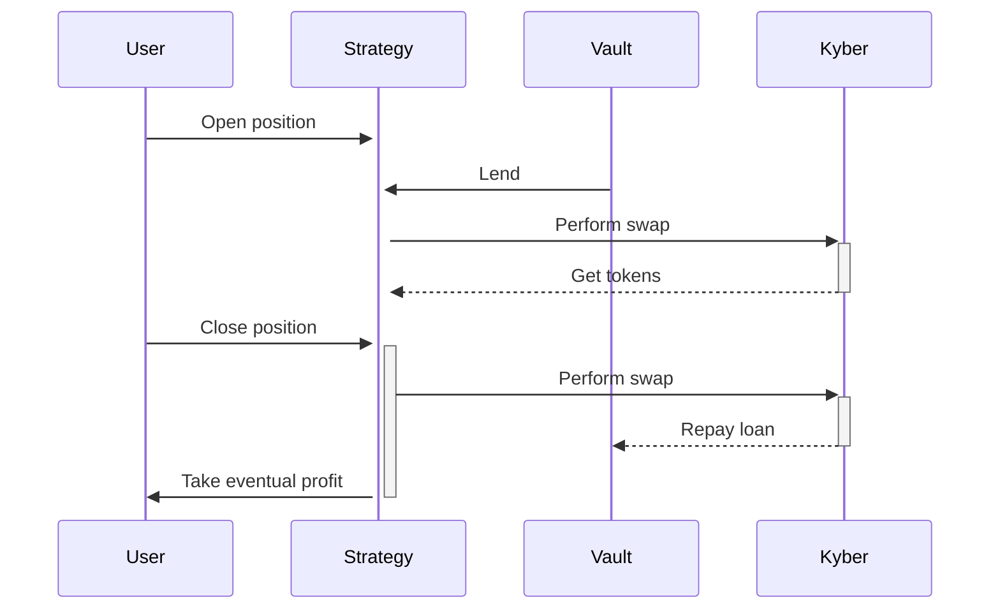

# Margin trading
Enabling traders to go long or short on any token pair

---

Margin trading is the simplest form of a service, in which the investment logic is exchanging one token for another one on an external exchange platform.

## How it works
Margin trading is a way of trading assets using funds provided by a third party lender. Compared to regular trading where traders use their own assets, margin accounts allow to access greater sums of capital, so that they can leverage their positions increasing market exposure. Essentially, margin trading amplifies trading results so that traders can get bigger profits on successful trades.
It is the first and foremost service of Ithil and the best way to get into investing in a simple way.

The service's quoter will keep track of the exchange rate of a Token A with respect to a Token B. When the position is closed, the Token B is exchanged to obtain back Token A: the quantity of Token A obtained will determine if the investment has been profitable or not.

### Examples
Let us make a numerical example of margin trading using DAI and WETH. 

Here is what happens with a **long position**:
- A user posts a margin of 100 DAI to the *Margin Trading Strategy* (MTS) contract and decides to go *long* with a x10 leverage on WETH.
- Assuming an exchange rate of 50 DAI/WETH, the MTS will then borrow 900 DAI from the vault, say at a daily interest rate of 0.1% and exchange 1000 DAI to obtain 20 WETH from an external protocol. This tokens are locked in the MTS and an onchain position is opened for the user.
- If the user closes the position after 10 days, when the exchange rate has increased by 20% to 60 DAI/WETH, then exchanging 20 WETH back will provide 1200 DAI to the MTS. 
- The MTS will repay the 909 DAI to the vault (900 borrowed plus 1% interest) and deliver the remaining 291 DAI to the user. With a market movement of only 20%, the user has realised a whopping 191% gain thanks to the 10x leverage.

With a **short position** the situation is similar:
- A user posts a margin of 100 DAI to the MTS contract and decides to go *short* with a x10 leverage on WETH.
- Assuming an exchange rate of 50 DAI/WETH, the MTS will then borrow 20 WETH from the vault, say at a daily interest rate of 0.1% and exchange them on an external protocol to obtain 1000 DAI. This tokens are locked in the MTS and an onchain position is opened for the user. At this point, 1100 DAI are locked in the MTS.
- If the user closes the position after 10 days, when the exchange rate has decreased by 20% to 40 DAI/WETH, then only 808 DAI are necessary to obtain the 20.2 WETH back to repay the vault (20 borrowed plus 1% interest). 
- The remaining 292 DAI are delivered to the user. A market movement of only 20% has made the trader earn 192% thanks to the 10x leverage.

In both cases, the user can post the margin either in DAI or WETH and the MTS will adjust the amount of the loan to take from the vault accordingly.
Of course, if the market moves unfavorably, the losses are equally aplified with respect of a non-leveraged trade. If the exchange falls below some critical level, the position will be liquidated.

## Risk Factor
The risk factor of r for a given token pair, means that for a position with that token pair to be liquidable, must incur a loss of at least $=(100-r)\%$.
Such number is dependant on the specific token: a more volatile token will have a higher risk factor. Then the actual risk factor of the pair, which is applied for liquidation, will be some sort of average (arithmetic, geometric, p-means...) of the two risk factors. The logic behind is that, the higher the token volatility, the more likely the value of the entitlement will fall below the threshold defined by the risk factor, and we do not want that a more likely event will trigger a liquidation (otherwise, too many positions will be liquidable, which we want to avoid).

## Implementations
Currently the following protocols support a leveraged staking service:
* Kyber (*on-chain dex aggregator*) - [kyber.network](https://kyber.network/)
* Uniswap (*the most famous dex on Ethereum*) - [uniswap.org](https://uniswap.org/)
